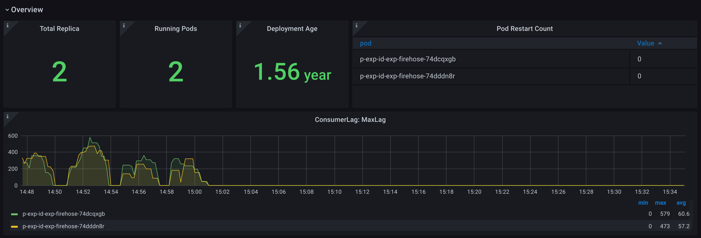
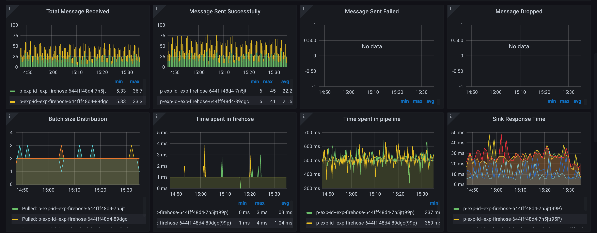
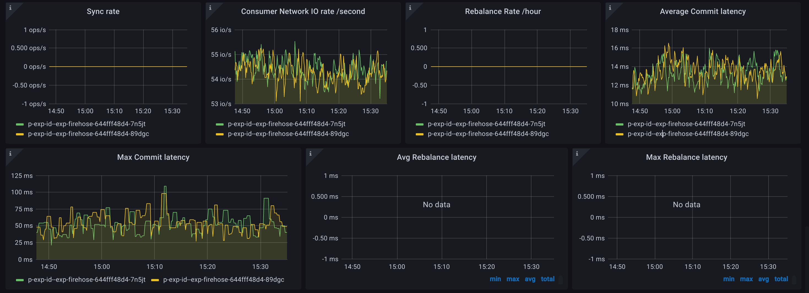
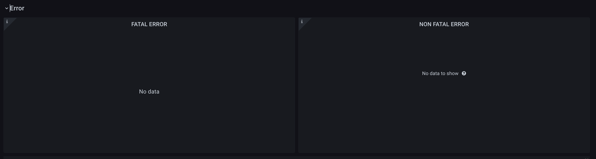
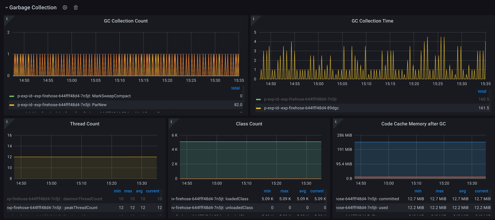

# Monitoring

Firehose provides a detailed health dashboard \(Grafana\) for effortless monitoring. Always know what’s going on with your deployment with built-in monitoring of throughput, response times, errors and more.

The Firehose Grafana dashboard provides detailed visualization of all Firehose metrics. For further details on each metric, please refer the [Metrics](../reference/metrics.md) section.

## Flow of Metrics from Firehose to Grafana


### StatsD Client

StatsD is a simple protocol for sending application metrics via UDP. StatsD is simple and has a tiny footprint. It can’t crash your application and has become the standard for large-scale metric collection. Firehose uses the [StatsD client](https://github.com/tim-group/java-statsd-client) library to send metrics to the Telegraf StatsD host. 

### Telegraf

[Telegraf](https://www.influxdata.com/time-series-platform/telegraf/) is an agent written in Go and accepts StatsD protocol metrics over UDP. It works as a metrics aggregator and then periodically flushes the metrics to InfluxDB database. Telegraf is deployed in a container along with Firehose container in the Kubernetes pod.

### InfluxDB

[InfluxDB](https://www.influxdata.com/) is a time-series database where all Firehose metrics are stored. It accepts metrics flushed from the Telegraf agent. InfluxDB stores the metrics along with corresponding metric tags, e.g. - `SUCCESS_TAG` , `FAILURE_TAG` InfluxDB is deployed on a separate Kubernetes cluster.

### Grafana

[Grafana](https://grafana.com/) is a multi-platform open-source analytics and interactive visualization web app. It pulls metrics data from the InfluxDB database and provides detailed visualization of all Firehose metrics in real-time. Metrics visualization can be obtained for all or specific pods.


## Setting Up Grafana with Firehose

### Set Up Grafana

Create a [Grafana Cloud](https://grafana.com/products/cloud/) account, to set up Grafana metrics dashboard on the cloud, or [download Grafana ](https://grafana.com/grafana/download)to set up Grafana dashboard locally.

### Set Up InfluxDB

Follow [this guide](https://grafana.com/docs/grafana/latest/getting-started/getting-started-influxdb/) to set up and link your InfluxDB database with Grafana. InfluxDB can be installed locally or can be set up on the cloud via [InfluxDB Cloud](https://www.influxdata.com/products/influxdb-cloud/).

### Set Up Telegraf

Lastly, set up Telegraf to send metrics to InfluxDB, following the corresponding instructions according to your Firehose deployment -

#### **Firehose in Docker or deployed locally** 

1. Follow [this guide](https://www.influxdata.com/blog/getting-started-with-sending-statsd-metrics-to-telegraf-influxdb/) to install and set up Telegraf as the StatsD host. 
2. Configure the Firehose environment variables `METRIC_STATSD_HOST` and `METRIC_STATSD_PORT`  to the IP address and port on which Telegraf is listening. By default, `METRIC_STATSD_HOST` is set to `localhost` and `METRIC_STATSD_PORT` is set to the default listener port of Telegraf, i.e.`8125` 
3.  Configure the IP address and port of the InfluxDB server in the file `~/.telegraf/telegraf.conf`

#### Firehose deployed on Kubernetes ****

1. Follow[ this guide](https://github.com/odpf/charts/tree/main/stable/firehose#readme) for deploying Firehose on a Kubernetes cluster using a Helm chart. 
2. Configure the following parameters in the default [values.yaml](https://github.com/odpf/charts/blob/main/stable/firehose/values.yaml) file and run - 

```text
$ helm install my-release -f values.yaml odpf/firehose
```

| Key | Type | Default | Description |
| :--- | :--- | :--- | :--- |
| telegraf.config.output.influxdb.database | string | `"test-db"` | db name for telegraf influxdb output |
| telegraf.config.output.influxdb.enabled | bool | `false` | flag for enabling telegraf influxdb output |
| telegraf.config.output.influxdb.retention\_policy | string | `"autogen"` | retention policy for telegraf influxdb output |
| telegraf.config.output.influxdb.urls | list | `["http://localhost:8086"]` | influxdb urls for telegraf output |
| telegraf.enabled | bool | `false` | flag for enabling telegraf |


## Grafana Dashboard

[Grafana](https://grafana.com/) is a multi-platform open-source analytics and interactive visualization web application. It provides charts, graphs, and alerts for the web when connected to supported data sources. A licensed Grafana Enterprise version with additional capabilities is also available as a self-hosted installation or an account on the Grafana Labs cloud service.

Grafana dashboard can be loaded on your Grafana cloud account by importing the JSON file `firehose-grafana-dashboard.json` in the `docs/assets/` directory. 


Load a Firehose dashboard by configuring the following parameters - 

* **Data Source** - name of InfluxDB database for metrics
* **Prometheus Data Source** - Prometheus cluster name if any
* **Organization** - name of the organization
* **Landscape** - id/th/vn/gl
* **Firehose Name** - name of the Firehose
* **Pod** - specify a particular Kubernetes pod ID or select **All** to track all pods.

## Features of Grafana dashboard

* metrics of every pod at any point of time can be obtained by hovering over that time coordinate.
* each pod has its own color code to distinguish it from other pods, in the visualization graph.
* minimum, maximum, and average values of the metrics are displayed for every pod.

## Dashboard Sections

### Type Details


### Overview





### Pods Health


### Kafka Consumer Details




### Error



### Memory


### Garbage Collection




### Retry


### HTTP Sink


### Filter


